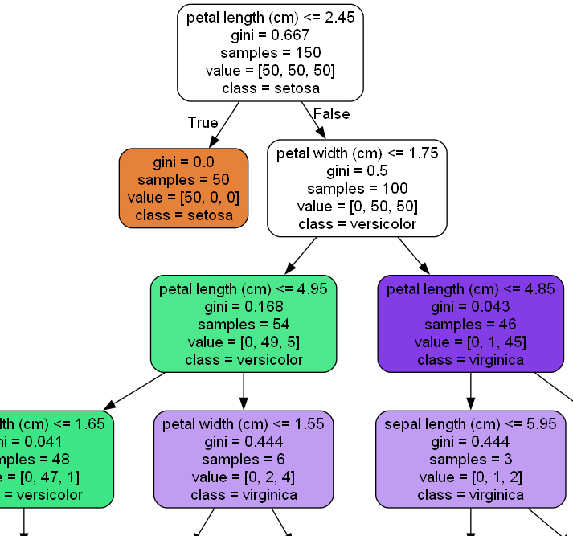

## Decision Trees
---

### What are they?
Decision Trees are a hierarchical tree like structure whose root is a collection of instances with  definite outcomes. Imagine a scenario where you have bearings. These bearings have a set of features that are peculiar to each of them from their physical appearance down to the actual organization of atoms in their structure.
The features maybe color, radius, age( or quite accurately date since manufacture) and the length of time it has been in use.
The features are descriptive elements that offer variability in an attempt at trying to establish the possibility of an outcome in this case, fracturing of the bearings.

ML models when thought about in the broad sense can be thought of as attempts at trying to find an aggregate that quite accurately describes a phenomenon. This is finding the function $f(x)$   that maps the features $x$ .

So we have a set of features that describe properties of individual bearings whose outcome we know of when they are subjected to some force therefore we are attempting to determine the outcome of future bearings given the historical data.


An example: 


This is a decision tree whose split criteria is gini index.
### How they work
With decision trees the first split is made with a feature that attempts to classify the the features definitively to their outcomes. This is synonymous with establishing purity in a dataset. At the upper sections of the tree, the split may not result to completely pure descriptions of the outcomes but as the tree grows, the capbility of the tree to classify the outcome based on the selected attribute increases.

In this atttempt to classify the features to their outomes, certain criteria are employed to help with the creation of tree splits.
  - Information Gain
  - Split Gain Ratio
  - Gini index

- **Information Gain**
Information Gain as applied in machine learning has its roots in Shannon's Information Theory.
```math
                $\text{Info(D)} = -\sum_{i=1}^m P_i log_2 (P_i)$
```

$P_i$ in this case is the probability of having a particular outcome given the set of multiple possible outcomes. i.e $\frac{|C_i,D|}{|D|}$ 

$Info(D)$ describes the entropy of the dataset D. The higher the number of possible target outcomes, the higher the entropy. A dataset with only 1 outcome results to zero entropy.

```math
            $Info_A(D) =\sum_{j=1}^m \left(\frac{|D_j|}{|D|}\right) * Info(D_j)$
```

 $Info_A D$ describes the amount of information still needed after partitioning to arrive at an exact classification.

The information gain is the difference between original information requirement and new requirement obtained after partitioning on A.
                   
```math
			 $Gain_A = Info(D) - Info_A(D)$
```

$Gain(A)$ - the attribute $(A)$ with the highest gain becomes the selected criteria for splitting of the node.
___
###### Most (if not all) of this information can be obtained in [Data Mining Concepts and techniques](link)


